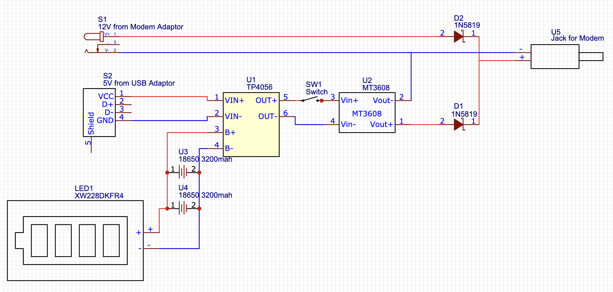
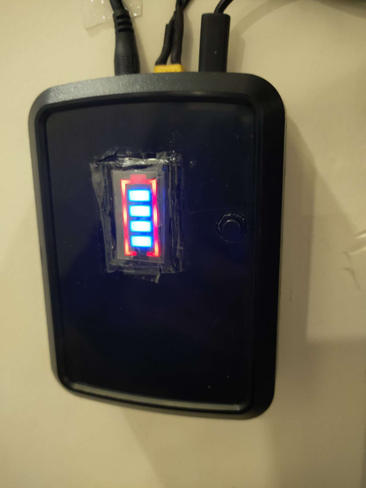
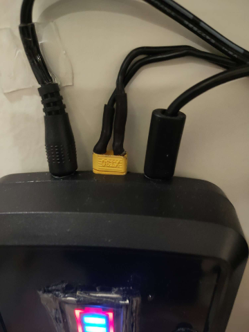
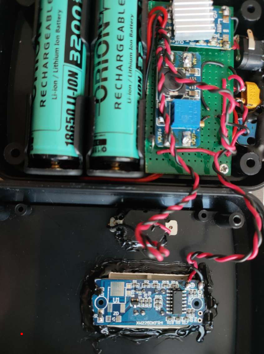

## Ev Yapımı UPS / Schottky (Şotki) Diyot ile..

12v 500mah beslemeye sahip Asus modemime yaptığım ev yapımı ups çalışmamı paylaşıyorum.
  Öncelikle anlatılanlar sadece amatör bir çalışma olup örnek amaçlı paylaşılmaktadır. Bu tür uygulamalarda iyice araştırıp veya uzmanlara danışarak uygulama yapmanızı tavsiye ederim.
  Birçok araştırmadan sonra amatör olarak hazırladığım bu düzenek ile modem sadece wifi kullanımı halinde 4 saati aşkın bir sürede çalışmıştır. 
  Batarya, komponent ve diğer ekipmanı Altınkaya isimli bir firmadan aldığım siyah plastik bir kutu içerisine monte ettim. Kutu ile uğraşacağınız bu tür işlemler için bir hobi dril seti edinmenizi tavsiye ederim.
  Faydalı olması dileği ile ..

### Bağlantı Şeması

### Gereksinimler
- 2 adet 1N5819 schottky diyot (modemin ihtiyacı 1 amper üzerinde olacak ise dayanımı daha yüksek bir diyot seçmekte fayda vardır)
- 2.5mm dişi power jack (2.5mm örnektir, modem adaptöründen gelen jack hangi boyutta ise)
- 2.5mm erkek power jack (2.5mm örnektir, modemin girişindeki jack hangi boyutta ise)
- TP4056 batarya şarj modülü. (Eğer mikro şarj girişi kullanılmayacaksa yine Usb B, mini yada mikro breadboard modülü eklenebilir)
- MT3608 Step-up voltaj regülatörü
- XW228DKFR4 batarya pil göstergesi
- 2 adet 18650 3.7v 3200mah lion pil (mah değeri isteğe göre değişebilir)
- 2 adet 18650 pil yatağı
- 1 adet switch yada on off button (kullanımı opsiyoneldir)

### Çalışma Şekli

 Öncelikle; 12v modem adaptöründen gelen akım şotki diyotundan geçerek yine modeme gidişi sağlanır. Bu şebeke elektriğinin direk modeme geçişi içindir.
  Diğer hatta geçecek olursak; 5v adaptörden gelen akım TP4056 ile bataryalara yönelir. Batarya ya durumunu gözlemlemek için direk batarya pil göstergesi bağlanır.
 Batarya üzerinden çıkan elektrik ise switch üzerinden ile yükseltici regülatöre geçer.
 Regülatör üzerindeki trimpottan yapılan ayar vasıtasıyla 12V düzeyine çıkan akım diğer şotki diyotuna geçerek 12v adaptör gücü ile birleşerek modeme gider.
 Şotki diyotunun buradaki faydası bataryadan gelen elektiğin pozitifi ile modem adaptörü üzerinden gelen elektiğin pozitifinin birbirlerine akmasını yani ters polarizasyonu engelemektir. 
 
 Bu durumda aktif-aktif mantık ile 2 farklı akım kaynağından beslenen modem çalışmaktadır. Bu 2 akım kaynağından herhangi biri çekildiğinde modem çalışmaya devam edecektir. 
 Bizim işimize yaran kısmı elektrik kesintisinde adaptör üzerinden akan akım kesilir fakat aktif olan diğer batarya akımı modemin çalışmaya devamını sağlar.
 

### Öneri ve Uyarılar
- Batarya pil göstergesi gayet parlak bir ışığa sahiptir. Işıktan rahatsız olabileceğiniz bir yerde bulunacak ise ekranına küçük bir film parçası ekleyerek ışığı azaltabilirsiniz.
- Özellikle TP4056 bataryaları şarj ederken ciddi oranda ısınabilmekte olup çipler üzerine bir yada birkaç küçük soğutucu kullanımı faydalı ve gerekli olabilir.
- MT3608 ile voltaj ayarlamasını yapmadan önce adaptörden gelen voltajı şotki diyotundan geçtikten sonra ölçerek tesbit edin ve akabinde bu regülatörden çıkacak gücü yine diğer diyottan çıktıktan sonra ölçerek ayarlayın, bu şekilde daha net ayarlama yapabilirsiniz.
- MT3608'den daha yüksek güçte (2, 3 ve 4 amper çıkışı olan regülatörler gibi) regülatörler kullanırsanız modemin ihtiyacından fazla bir gücü sağlayacak ve bataryalar kat ve kat daha hızlı bitebilir.
- Bu tür komponent, batarya ve ekipmanı ısınma kaynaklı oluşabilecek sorunlardan dolayı ilk birkaç kullanımda gözlem altında tutunuz. 
- Switch yada butonun mantığı ise tüm fişleri çekip bu upsi boşa çıkarttığınızda dahi bataryadan geçen akım regülatöre akmaya devam edecek ve kaynak tüketimi olmasa bile zamanla bataryanın tükenmesine sebep olacaktır. Aradaki gücün kesilmesi yapıyı maintenance etmek için en iyi yöntemdir.
