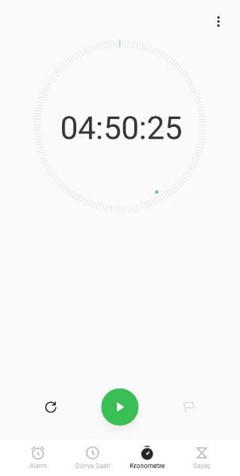
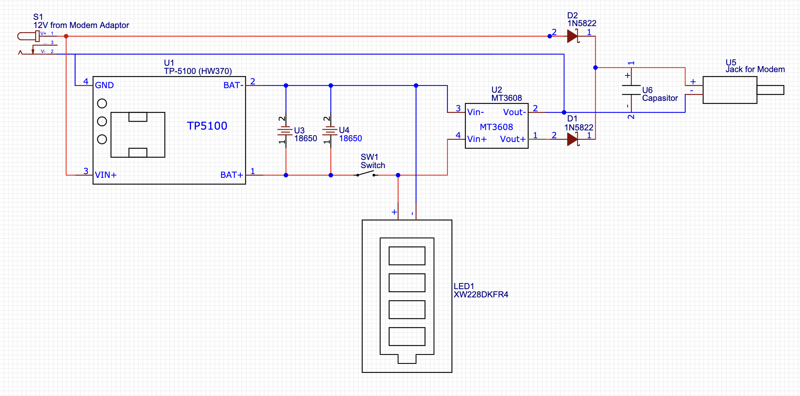
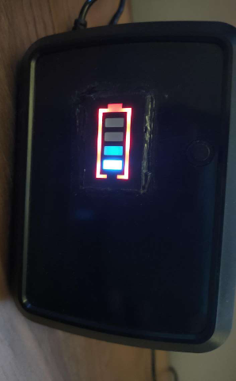
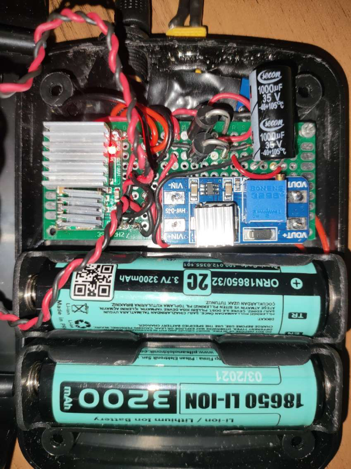
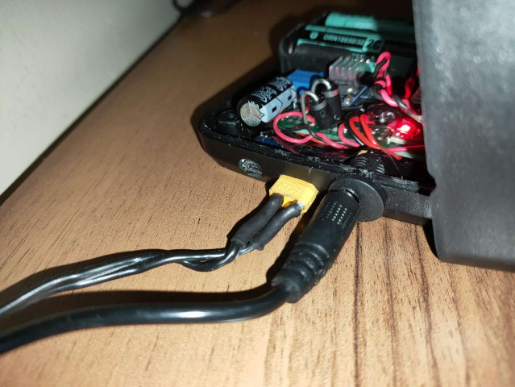

## Ev Yapımı UPS / Schottky (Şotki) Diyot ile.. 

### * 2. sürüm güncellemesi.. (Ocak 2023)
&nbsp;&nbsp;&nbsp;&nbsp;&nbsp;&nbsp;Eski haliyle bataryalar için 5v beslemesi gerekiyordu. TP5100'e yükselterek tek güç kaynağı kullanımı çözüm oldu.
 &nbsp;&nbsp;&nbsp;&nbsp;&nbsp;&nbsp;1N5822 şotki diyot güncellemesi ile 3A'e kadar güç kaynağı kullanımındaki ters polarizasyon koruması arttırıldı.
 &nbsp;&nbsp;&nbsp;&nbsp;&nbsp;&nbsp;Anahtar led batarya göstergesinin önüne alındı. Böylelikle anahtarın kapandığında led sönerek işlevi gözlemlenebilir hale geldi.
 &nbsp;&nbsp;&nbsp;&nbsp;&nbsp;&nbsp;1000uf kondansatör ile modemin çektiği akım sonucu dalgalanmalar en aza indirildi. Hatta bu stabilite sayesinde ups kullanımı 5 saate yaklaşmıştır. 
 &nbsp;&nbsp;&nbsp;&nbsp;&nbsp;&nbsp;Bir önceki eski haline [buradan](Readme_v1.md) erişebilirsiniz..
  

### Giriş
&nbsp;&nbsp;&nbsp;&nbsp;&nbsp;&nbsp;12v 500mah beslemeye sahip Asus modemime yaptığım ev yapımı ups çalışmamı paylaşıyorum.
 &nbsp;&nbsp;&nbsp;&nbsp;&nbsp;&nbsp;Öncelikle anlatılanlar sadece amatör bir çalışma olup örnek amaçlı paylaşılmaktadır. Bu tür uygulamalarda iyice araştırıp veya uzmanlara danışarak uygulama yapmanızı tavsiye ederim.
 &nbsp;&nbsp;&nbsp;&nbsp;&nbsp;&nbsp;Birçok araştırmadan sonra amatör olarak hazırladığım bu düzenek ile modem sadece wifi kullanımı halinde 5 saat civarı bir sürede çalışmıştır. 
 &nbsp;&nbsp;&nbsp;&nbsp;&nbsp;&nbsp;Batarya, komponent ve diğer ekipmanı Altınkaya isimli bir firmadan aldığım siyah plastik bir kutu içerisine monte ettim. Kutu ile uğraşacağınız bu tür işlemler için bir hobi dril seti edinmenizi ayrıca tavsiye ederim.
 &nbsp;&nbsp;&nbsp;&nbsp;&nbsp;&nbsp;Sizde öneri, görüş ve fikirlerinizi paylaşarak bu ve benzeri projelerde bana ve bir çok insana destek olabilirsiniz. Bilgi paylaştıkça çoğalır..
 &nbsp;&nbsp;&nbsp;&nbsp;&nbsp;&nbsp;Faydalı olması dileği ile ..

### Gereksinimler
- 1 adet 12v 2A adaptör (1N5822 ile 3A'e kadar desteklenir)
- 2 adet 1N5822 schottky diyot 
- 2.5mm dişi power jack (2.5mm örnektir, modem adaptöründen gelen jack hangi boyutta ise)
- 2.5mm erkek power jack (2.5mm örnektir, modemin girişindeki jack hangi boyutta ise)
- TP5100 batarya şarj modülü. 
- MT3608 Step-up voltaj regülatörü
- XW228DKFR4 (spbkbs-10) batarya pil göstergesi (kullanımı opsiyonel)
- 2 adet 18650 3.7v 3200mah lion pil (mah değeri isteğe göre değişebilir)
- 2 adet 18650 pil yatağı
- 1 adet dişi ve erkekli lipo pil konnektörü seti
- 1 adet anahtar yada on off button (kullanımı opsiyonel)
- 1 adet 16v 1000uf kondansatör (elimde 35v bulunduğu için onu kullandım)
- 1 adet raspberry pi soğutucu seti (opsiyonel ancak aşırı ısınmanın önüne geçeceği için faydalıdır..)

### Bağlantı Şeması

### Çalışma Şekli
&nbsp;&nbsp;&nbsp;&nbsp;&nbsp;&nbsp;Öncelikle; 12v  adaptörden gelen akım (S1) ikiye ayrılarak ilki TP5100 ile batarya şarjı için yönlendirilir diğeri ise şotki diyotundan (D2) geçerek modeme ulaşacak şebeke akımı sağlanır.
 &nbsp;&nbsp;&nbsp;&nbsp;&nbsp;&nbsp;TP5100'dan gelen akım (U1) bataryalara yönlendirilir. Bataryalardan gelen akım (SW1) anahtarı vasıtasıyla bakım amaçlı kesilebilir hale gelir. Batarya durumunu gözlemlemek için batarya pil göstergesi (LED1) bağlanır.
 &nbsp;&nbsp;&nbsp;&nbsp;&nbsp;&nbsp;Anahtar üzerinden (SW1) gelen akım artık yükseltici regülatöre (U2) geçer.
 &nbsp;&nbsp;&nbsp;&nbsp;&nbsp;&nbsp;Regülatör (U2) üzerindeki trimpottan yapılan ayar vasıtasıyla 12V düzeyine çıkan akım diğer şotki diyotuna (D1) geçerek 12v adaptör gücü ile birleşerek modeme gider.
 &nbsp;&nbsp;&nbsp;&nbsp;&nbsp;&nbsp;Şotki diyotunun buradaki faydası bataryadan gelen elektiğin pozitifi ile modem adaptörü üzerinden gelen elektiğin pozitifinin birbirlerine akmasını yani ters polarizasyonu engelemektir.
 &nbsp;&nbsp;&nbsp;&nbsp;&nbsp;&nbsp;Bu durumda aktif-aktif mantık ile 2 farklı akım kaynağından beslenen modem çalışmaktadır. Bu 2 akım kaynağından herhangi biri çekildiğinde modem çalışmaya devam edecektir. 
 &nbsp;&nbsp;&nbsp;&nbsp;&nbsp;&nbsp;Bizim işimize yaran kısmı elektrik kesintisinde adaptör üzerinden akan akım kesilir fakat aktif olan diğer batarya akımı modemin çalışmaya devamını sağlar.
 &nbsp;&nbsp;&nbsp;&nbsp;&nbsp;&nbsp;Son olarak aynı akıma sahip iki güç kaynağından hangisinin öncelikli kullanılacağı konusunda güç kaynaklarının gerilimi büyük olan baskın olmaktadır. 
 &nbsp;&nbsp;&nbsp;&nbsp;&nbsp;&nbsp;Projemde bunu sağlayabilmek için adaptörü 12v <b>2 amper</b> tercih ettim. Bunu anlamak için; bataryadan gelen akımın gerilimi olan 6400mah ve ayrıca diyelim ki tp5100 (U1) şarj için 1000mah olarak ekstra gerilim gönderiyor olsun, bunlar sırasıyla tp5100 (U1) ile %7, pil göstergesi ile 5mah, 12v'a yükselirken doğal kayıp olarak %3.24, yükselten regülatör (U2) ile %3 kayıp ve şotki diyotu (D1) üzerinden %1 kayıp ile totalde 12v 1971 mah seviyesinde hesapladım ve <b>2 amper ve üzeri</b> bir adaptörün batarya gerilimini bastırmakta yeterli olduğunu gözlemledim. (Sağlaması; ((6400 + 1000 - 5) / 1.07) / (12 / 3.7) / 1.07 / 1.01 şeklindedir.)

### Fotoğraflar

### Öneri ve Uyarılar
- Batarya pil göstergesi gayet parlak bir ışığa sahiptir. Işıktan rahatsız olabileceğiniz bir yerde bulunacak ise ekranına küçük bir film parçası ekleyerek ışığı azaltabilirsiniz.
- Özellikle TP5100 bataryaları şarj ederken ciddi oranda ısınabilmekte olup çipler üzerine bir yada birkaç küçük soğutucu kullanımı faydalı ve gerekli olabilir.
- MT3608 ile voltaj ayarlamasını yapmadan önce adaptörden gelen voltajı şotki diyotundan geçtikten sonra ölçerek tesbit edin ve akabinde bu regülatörden çıkacak gücü yine diğer diyottan çıktıktan sonra ölçerek ayarlayın, bu şekilde daha net ayarlama yapabilirsiniz.
- MT3608'den daha yüksek güçte (2, 3 ve 4 amper çıkışı olan regülatörler gibi) regülatörler kullanırsanız modemin ihtiyacından fazla bir gücü sağlayacak ve bataryalar kat ve kat daha hızlı bitebilir.
- Bu tür komponent, batarya ve ekipmanı ısınma kaynaklı oluşabilecek sorunlardan dolayı ilk birkaç kullanımda gözlem altında tutunuz. 
- Anahtarın mantığı ise tüm fişleri çekip bu upsi boşa çıkarttığınızda dahi bataryadan geçen akım regülatöre akmaya devam edecek ve kaynak tüketimi olmasa bile zamanla bataryanın tükenmesine sebep olacaktır. Aradaki gücün kesilmesi yapıyı maintenance etmek için en iyi yöntemdir.
